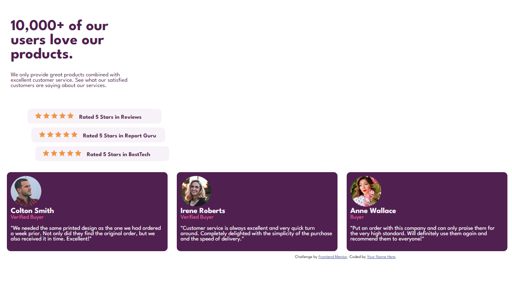

# Idea para CLASE HTML

Este es material para dar la primera clase de HTML.

## Brief 🗺️
  > La idea de esta clase es que sea interactiva logrando crear un diseño de una página web sencilla y que puedas explicar los temas siguientes temas: 

  - Documentos HTML
  - Sintaxis y creación de documentos HTML
  - Visualización de HTML en el navegador
  - Consulta y uso de la documentación oficial
  - Elementos de estructura
  - Elementos básicos
  - Atributos de elementos
  - Elementos div

 * * *
 

### ⬆️⬆️⬆️[Link de proyecto completo](https://github.com/cchavezmx/intro-web-reto-1/tree/main) ⬆️⬆️⬆️

> __Su desafío es construir esta sección de prueba social y lograr que se parezca lo más posible al diseño.__

  * * * 

## My process 🚀

### El proyecto está dividido en 3 PR's

  - __Branch main__ Estructura base de la página web
    - Explicar lo que se ve en index.html

  - Estructura del proyecto

  El proyecto tiene todos los archivos necesarios para crear la página web.
   
   - __Design__: contiene los archivos de diseño de la página web, para que el alumno pueda ver el diseño de la página web tanto en modo escritorio como en modo móvil.

   - __Images__: los archivos necesarios para crear la página web.

   - __style-guide.md__: contiene lista de estilos y recomendaciones para el diseño de la página web.

   - __index.html__: es el archivo principal de la página web con los textos necesarios que se muestran en el proyecto.

> 💡 Puedes entregar por link de descarga el proyecto .

* * *

  - __Branch PT1__  Se colocan contenedores básicos para el diseño de la página web
    - Viwport
    - Elementos de estructura basica span, p, a.
    - Display: inline vs block

* * * 

  - __Branch PT2__  Se explica estructura básica de CSS todo con medidas absolutas.
    - Diferencia entre ID y Class
    - Selectores de elementos
    - Estructura y uso de CSS 
  
* * *

> Al final del la explicación de la clase deberá de quedar algo de la siguiente forma (PT2): 

* * *

- __Branch PT3__ contiene el archivo css completo. 

### Notas Finales 📝

  > Como puedes ver, el proyecto propone crear una clase en la que los alumnos puedan seguir, crear, interactuar y replicar un proyecto base de html

  > Las medidas usadas en css son en pixeles, esto con la finalidad de no complicar la explicación y terminos usados para la gente que no tiene experiencia en CSS o temas de diseño.

  > 💡 También se puede combinar esta clase con temas de GitHub y GitHub Pages, llevando al alumno a crear un repositorio y la página propuesta. 

 > Esté proyecto fue obtenido de FRONTEND MENTOR [LINK](https://www.frontendmentor.io)
 
