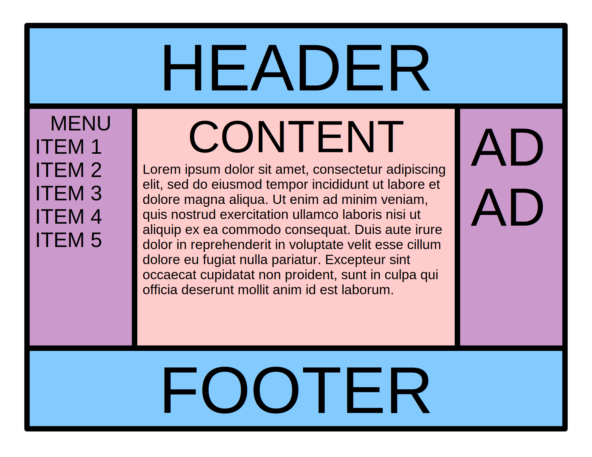

1,269 / 5,000
### El santo grial

 Es un diseño de página web que tiene múltiples columnas de igual altura que se definen con hojas de estilo. 
 
 Es comúnmente deseado e implementado, pero durante muchos años, las diversas formas en que podría implementarse con las tecnologías disponibles tenían inconvenientes.
 
 Debido a esto, encontrar una implementación óptima se comparó con buscar el escurridizo Santo Grial. 
 
 Las limitaciones de CSS y HTML, la conveniencia de páginas semánticamente significativas que se clasifiquen bien en los motores de búsqueda y las deficiencias de varios navegadores se combinaron históricamente para crear una situación en la que no había forma de crear este tipo de diseño que se consideraría totalmente correcto.
 
 Como las tecnologías subyacentes no proporcionaban una solución adecuada, los diseñadores web encontraron varias formas de sortear las limitaciones.
 
 Las soluciones alternativas comunes incluyeron cambios en la estructura de la página, la adición de gráficos, secuencias de comandos y el uso creativo de CSS. Estos métodos eran imperfectos, inconvenientes y algunos los consideraban un abuso de los estándares web y su intención.
 
 Los estándares web más recientes han proporcionado soluciones mucho más completas y sólidas para implementar este diseño. En particular, los módulos CSS Flexible Box Layout y CSS Grid Layout han proporcionado soluciones completas.

 

 ### IDEA PARA CLASE activdad 40minutos 🕑:
 se puede proponer a los alumnos el intentar hacer el reto desde cero.