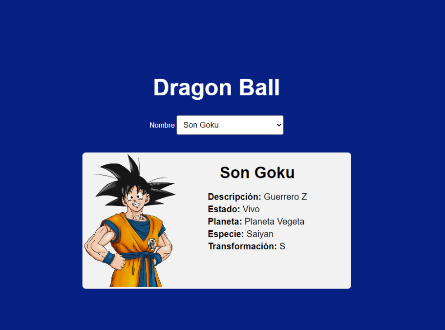

## Acerca del proyecto: 

Este proyecto ayudara a explicar peticiones con Axios y Fetch asi como el manejo y uso del Async / Await y del DOM.

También ayudara a empezar a familirizarte con la instalacion de librerias en nodejs asi como importar modúlos de JS

## Construido con: 

- [VITE]('https://vitejs.dev/')

* * *

