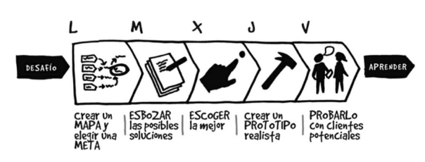

# Design Sprint: Guión práctico para senseis

El objetivo de este módulo es darle a nuestrxs estudiantes las herramientas necesarias para crear un demo de una app completa desde cero, enfocándonos en los aspectos más importantes para que el demo sea un éxito. Para esto, antes de escribir una sola línea de código, primero tenemos que enfocarnos en responder claramente, y con transparencia para todos los integrantes, preguntas clave como:

 - ¿Qué problema voy a resolver?
 - ¿Cuál es la parte fundamental de este problema que debemos atender?
 - ¿Cómo validamos que nuestra solución tech sí resuelve el problema?
 - ¿Cómo validamos que nuestro demo resuelve el problema, con el menor esfuerzo posible?

Así no nos centraremos esta vez en solo crear tecnología porque sí, esta vez nos centraremos en validar una hipótesis de solución de una forma inteligente, y crear tecnología enfocado en esta validación inicial.

Para todo lo mencionado anteriormente, seguiremos la metodología de Design Sprint, creada por Google Ventures para aterrizar y probar ideas en tan solo cinco días. Estos días se dividen de la siguiente manera:

 
Puedes seguir la guía que te presentamos a continuación para guiar a tus estudiantes día a día y seguro obtendrás buenos resultados. También puedes leer el pdf del libro de Sprint: Resolver problemas y testear ideas en 5 días que tenemos por acá en este drive de apoyo a sensei, si te gustaría profundizar más en estos temas tan valiosos ;)
