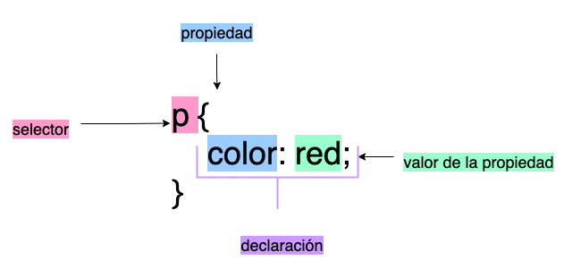

# CSS

Hojas de Estilo en Cascada,  Cascading Style Sheets o CSS, es un lenguaje de hojas de estilo que se utiliza para aplicar estilos a una página web. Estos te permiten cambiar el tamaño de la letra, el color, el color del fondo, crear columnas, crear estructuras, etc. Los archivos CSS, tienen la extensión .css

## Vincular una hoja de estilos

Para vincular una hoja de estilos a nuestro archivo HTML, utilizaras la etiqueta <link> dentro de la etiqueta <head>.

<aside>
 Ejemplo de como vincular un archivo HTML y CSS

```html
<!DOCTYPE html> 
<html>
  <head>
    <meta charset="utf-8">
		<link href="styles/style.css" rel="stylesheet" type="text/css">
    <title>Mi primer página web</title>
  </head>
  <body>
    <h1>Mi primer título</h1>
  </body>
</html>
```

```css
h1{
	color: peru;
}
```

</aside>

# Sintaxis

La sintaxis de CSS, esta compuesta por selector, declaración, propiedades y valor de la propiedad.



### Selector

Hace referencia al elemento HTML al que se le quiere aplicar un estilo.

Puedes seleccionar un elemento o seleccionar varios elementos.

```css
p{
	color:red;
}

h1, h2, h3{
	color: peru;
}
```

### Declaración o regla

Es aquella que especifica la propiedad y el valor de la propiedad; es decir una sola regla como **color:red;**

### Propiedades

Manearas de las cuales puedes dar estilo a un elemento HTML, esta va seguida de dos puntos ( : )

### Valor de la propiedad

Se coloca a la derecha de la propiedad

### Notas importantes

- Cada una de las declaraciones o conjunto de declaraciones, deberán estar encapsuladas entre llaves {}
- Después de cada propiedad, deberas usar : para separarla de de su valor.
- Después de cada regal, deberas utilizar el punto y cómo, para separar la regla de la siguiente.
- Las mayusculas y minúsculas son relevantes, por lo que sí en nuestro HTML, escribimos una clase que contenga mayusculas y en nuestro archivo CSS, no la escribimos con la mayúscula, no coincidirán y no funcionaran los estilos.

# Selectores

CSS utiliza selectores para delimitar los elementos HTML a los que les queremos aplicar un estilo específico.

| Nombre del selector | Qué selecciona | Ejemplo |
| --- | --- | --- |
| Etiqueta | Todos los elementos HTMl del tipo especificado | `p{color:red;}` |
| ID | Elemento HTML con él atributo ID específico. El selector de id se escribe precedido de #. | `#mi-id{font-size:24px;}` |
| Clase | Todos los elementos HTML con él atributo clase específico.El selector de id se escribe precedido de un punto ( . ) | `.mi-clase{margin:20px;}` |
| Universal | Selecciona absolutamente todos los elementos HTML | `*{color: blue;}` |
| Atributo | Todos los elementos en una página con él atributo especificado. | `img[src]{padding:30px;}` Selecciona ` `pero no `` |

# Comentarios

Los comentarios en los archivos CSS

```css
/* Soy un comentario de linea */

/* 
Soy un comentario 
multilinea 
*/
```

# Lecturas de Campus

- Kata Intro a la Web - CSS

# Recursos

[CSS | MDN](https://developer.mozilla.org/es/docs/Web/CSS)

[CSS Diner](https://flukeout.github.io/)