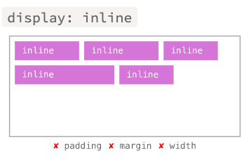

# Display

Display es una propiedad de CSS, que controla como se representa un elemento dentro del flujo del navegador.

La propiedad Display, nos permite mostrar u ocultar un elemento y modificar la forma en la que se muestra un elemento; por ejemplo: a una etiqueta de linea la podemos forzar para que se muestre como una etiqueta de bloque o una etiqueta de bloque la podemos forzar a que se muestre como una etiqueta de linea.

# Valores de display básicas

---

```css
display: none;
```

Oculta un elemento.

---

```css
display: inline;
```

Muestra un elemento con propiedades de elemento de línea.



---

```css
display: block;
```

Muestra un elemento con propiedades de bloque.


---

```css
display: inline-block;

```

Muestra un elemento con propiedades de bloque pero que no provoca un salto de
línea ni adopta una anchura del 100%.


<aside>
💡 Ejemplo de Display

```html
<!DOCTYPE html>
<html lang="en">
<head>
  <meta charset="UTF-8">
  <meta http-equiv="X-UA-Compatible" content="IE=edge">
  <meta name="viewport" content="width=device-width, initial-scale=1.0">
  <title>Display</title>
  <link rel="stylesheet" href="./display.css">
</head>
<body>
  
  <h2>Display</h2>
  <p>Sin modificaciones</p>
  <div class="display-div">
    Ejemplo div
  </div>
  <span class="display-span">Un ejemplo de span</span>
  <span class="display-span">Otro ejemplo de span</span>

  <p>Div, display none</p>
  <div class="display-none display-div">
    Ejemplo div
  </div>
  <span class="display-span">Un ejemplo de span</span>
  <span class="display-span">Otro ejemplo de span</span>

  <p>Div, display inline</p>
  <div class="display-inline display-div">
    Ejemplo div
  </div>
  <span class="display-span">Un ejemplo de span</span>
  <span class="display-span">Otro ejemplo de span</span>

  <p>Span, display block</p>
  <div class="display-div">
    Ejemplo div
  </div>
  <span class="display-block display-span">Un ejemplo de span</span>
  <span class="display-block display-span">Otro ejemplo de span</span>

  <p>Div, display inline y Span, display block</p>
  <div class="display-inline display-div">
    Ejemplo div
  </div>
  <span class="display-block display-span">Un ejemplo de span</span>
  <span class="display-block display-span">Otro ejemplo de span</span>

  <p>Div, display inline-block y Span, display block</p>
  <div class="display-inline-block display-div">
    Ejemplo div
  </div>
  <span class=" display-span">Un ejemplo de span</span>
  <span class="display-block display-span">Un ejemplo de span</span>
  <span class="display-block display-span">Otro ejemplo de span</span>

</body>
</html>
```

```css
/* DISPLAY */

.display-div{
  background-color: pink;
  padding: 5px;
}
.display-span{
  background-color: purple;
  padding: 5px;
}

.display-none{
display: none;
}

.display-inline{
  display: inline;
}

.display-block{
  display: block;
}

.display-inline-block{
  display: inline-block;
}
```

</aside>

# Lecturas en Campus

- Kata Intro a la Web - Display

# Recursos

[display - CSS | MDN](https://developer.mozilla.org/es/docs/Web/CSS/display)

[CSS layout cheat sheet · Web Dev Topics · Learn the Web](https://learn-the-web.algonquindesign.ca/topics/css-layout-cheat-sheet/)