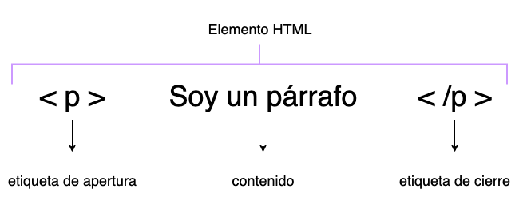

# HTML

# ¿Qué es HTML?

Hyper Text Markup Language o Lenguaje de Marcado de Hipertexto, de acuerdo a Mozilla Developers es el código que se utiliza para estructurar y desplegar una página web y sus contenidos. Los documentos HTML se guardan con la extension .html.

Por lo tanto el HTML es la estructura y el contenido de nuestra página web, es el archivo principal a partir del cual se llamaran los diferentes archivos que se necesitan para visualizar nuestra pagina web; por ejemplo llamaremos a las hojas de estilo, imágenes, etc.

# Sintaxis de un elemento HTML

Los elementos HTML se escriben con **etiquetas**. 



Una **etiqueta** se escribe con los símbolos de menor que (<) y mayor que (>) y dentro escribiremos el nombre del elemento.


Normalmente los elementos HTML requieren de una etiqueta de apertura y una de cierre. La diferencia entre una etiqueta de apertura y una de cierre, es que en la etiqueta de cierre pondremos una / antes del nombre del elemento.


También existen elementos que no necesitan una etiqueta de cierre, como por ejemplo  o <br>; muchas veces puedes encontrarlas escritas con la / al final de la etiqueta como . Esto no es incorrecto, pero tampoco es necesario. 

<aside>
 Ejemplo de cómo el navegador ignora las tabulaciones y saltos de página, por lo que podemos emplearlos para dar un formato a nuestro código.

```html
<p>
	Ejemplo de texto.
	Otra frase.
<p>

<p>
	Ejemplo de texto
<p>

<p>
	Ejemplo de texto
<p>

<p>
	Ejemplo de texto
<p>
```

</aside>

# Atributos para las etiquetas HTML

Los atributos son referencias para el navegador que podemos escribir en los elementos HTML, estos se escriben en la etiqueta de apertura y se pueden escribir varios atributos separados por espacios. 

### Sintaxis de un atributo

Se escribe el atributo seguido de un signo = y el valor entre comillas.


### Orden de los atributos

Se recomienda seguir el siguiente orden de los atributos HTML, con el fin de facilitar la lectura del código.

- class
- id, name
- data-*
- src, for, type, href, value
- title, alt
- role, aria-*
- tabindex
- style

# Anatomía de un documento HTML

En una pagina web necesitamos ciertas etiquetas que no son de contenido, para que le navegador renderice correctamente nuestra página web.

```html
<!DOCTYPE html> 
<html>
  <head>
    <meta charset="utf-8">
    <title>Mi primer página web</title>
  </head>
  <body>
    
  </body>
</html>
```

- `<!DOCTYPE html>`

Indica el tipo de documento, se pone al principio del documento html y no se cierra.

- `<html></html>`

Elemento que encierra todo el contenido de la página, también se le conoce como elemento raiz (root)

- `<head></head>`

Elemento que encierra todo aquello que se quiere incluir en la página, pero que no es contenido visible para el usuario. Contiene, título de la página, hoja de estilos, descripción de la página, etc.

- `<meta charset="utf-8">`

Este elemento indica la codificación de la página; es decir; establece los caracteres que se utilizaran en el documento.

- `<title></title>`

Indica el titulo de página, el cual aparece en la pestaña o en la barra de titulo del navegador.

- `<body></body>`

Elemento que encierra todo el contenido que deseas mostrar al usuario.

# Etiquetas de texto

| `<p></p>` | Marca un párrafo |
| --- | --- |
| `<h1></h1>` | Marca un encabezado de primer nivel. Solo puede haber uno por página. |
| `<h2></h2>` | Marca un encabezado de segundo nivel. |
| `<h3></h3>` | Marca un encabezado de tercer nivel. |
| `<h4></h4>` | Marca un encabezado de cuarto nivel. |
| `<h5></h5>` | Marca un encabezado de quinto nivel. |
| `<h6></h6> `| Marca un encabezado de sexto nivel. |
| `<span></span>` | Sirve para acotar trozos de texto. |

Algunas etiquetas de texto tienen valor semántico, es decir; indican que es el contenido que contienen, en lugar de cómo se debe formatear al mostrar el documento. Estas nos ayudan a los motores de búsqueda como Google a indexas correctamente los contenidos del sitio. 

| `<em></em>` | Etiqueta semántica para hace énfasis en una palabra en particular. Normalmente se renderiza como una cursiva; recuerda no utilizarla para dar estilo. |
| --- | --- |
| `<strong></strong> `| Etiqueta semántica para indicar relevancia en un texto de una palabra en particular. Normalmente se renderiza como una negrita.; recuerda no utilizarla para dar estilo. |

<aside>
 Ejemplo de cómo el navegador muestra las principales etiquetas de texto

```html
<h1>Encabezado nivel 1</h1> 
<h2>Encabezado nivel 2</h2>
<h3>Encabezado nivel 3</h3>
<h4>Encabezado nivel 4</h4>
<h5>Encabezado nivel 5</h5>
<h6>Encabezado nivel 6</h6>
<p>Ejemplo de parrafo<p>
<p>Parrafo con <strong>la etiqueta strong</strong> </p>
<p>Parrafo con <em>énfasis</em> </p>
<p>Parrafo con <span>span</span> </p>
```

</aside>

# Etiquetas HTML de imágenes y enlaces

Utilizamos estas etiquetas para añadir contenido externo a nuestro archivo HTML.

## Etiqueta ``

La etiqueta ``  se utiliza para añadir una imagen, esta etiqueta cuenta con un atributo llamado **src**, hace referencia a source de origen, el cual contendrá la ruta de la imagen. También cuenta con un atributo llamado **alt**, hace referencia a texto alternativo, este es un texto que lee un lector de pantalla.


## Etiqueta `<a>`

La etiqueta `<a>` se utiliza para añadir enlaces, esta cuenta con un atributo llamado href indica la dirección que estamos vinculando. Esta puede ser la dirección de una pagina web, otro archivo html, incluso una sección del mismo archivo; en ese caso, el href empezará con # y el valor del id.

Si queremos abrir el enlace en una ventana nueva, añadiremos el atributo target= ̋_blank ̋ .

La etiqueta puede contener texto o cualquier otro elemento. 


 Ejemplo de cómo utilizar la etiqueta `<a>`

```html
<a href="https://www.google.com/">Ir a Google</a>
<a href="https://www.google.com/" target="_blank">Ir a Google, en otra pestaña</a>
<a href="#otraSeccion">Ir a una parte de este documento</a>

<div id="otraSeccion">
  <p>Parrafo 1 Lorem ipsum dolor sit amet consectetur adipisicing elit. Similique praesentium cum nihil aut eligendi ullam
    nobis, voluptatum distinctio natus. Voluptate cumque, voluptatum corrupti officia assumenda quos eligendi
    reprehenderit nam laboriosam.</p>
  <p>Parrafo 2 Lorem ipsum dolor sit amet consectetur adipisicing elit. Similique praesentium cum nihil aut eligendi ullam
    nobis, voluptatum distinctio natus. Voluptate cumque, voluptatum corrupti officia assumenda quos eligendi
    reprehenderit nam laboriosam.</p>
</div>
```

## Rutas

Las rutas nos ayudan a especificar la ubicación de un archivo, imagen, audio, gif, etc. en un proyecto.

### Rutas relativas

Las rutas relativas indican la ruta de un archivo en su ubicación actual en el servidor o directorio del proyecto.

```html
<a href="../../../archivos/calendario.pdf" alt="Calendario"> Descargar Calendario </a>
```

### Rutas absolutas

Las rutas absolutas es una URL completa

Una URL indica todas las partes de la URL (protocolo, servidor y ruta completa).

```html

<a href="https://www.mipaginaweb.com/archivos/calendario.pdf" alt="Calendario"> Descargar Calendario </a>
```

# Etiquetas HTML de bloque

Son elementos que ocupan todo el ancho disponible y no permite que otro elemento se coloque a su lado.

Los siguientes son algunos elementos "en bloque":

address, blockquote, center, dir, div, dl, fieldset, form, h1, h2, h3, h4, h5, h6, hr, isindex, menu, noframes, noscript, ol, p, pre, table, ul.

<aside>
 Ejemplo de etiquetas de bloque

```html
<p>
		Este párrafo es un elemento en bloque; Lorem ipsum dolor sit amet consectetur adipisicing elit. Similique praesentium cum nihil aut eligendi ullam
    nobis, voluptatum distinctio natus. Voluptate cumque, voluptatum corrupti officia assumenda quos eligendi
    reprehenderit nam laboriosam.
</p>
```

```css
p { 
	background-color: peru; 
}
```

</aside>

# Etiquetas HTML de linea

Son elementos que ocupan el espacio mínimo necesario en horizontal, y permite que otros elementos se coloquen a su lado.

Los siguientes elementos son "en línea":

b, big, i, small, tt, abbr, acronym, cite, code, dfn, em, kbd, strong, samp, time, var, a, bdo, br, img, map, object, q, script, span, sub, sup, button, input, label, select, textarea

<aside>
 Ejemplo de etiquetas de Linea

```html
<button>Boton 1</button>
<button>Boton 2</button>
<span>Span</span>
<button>Boton 3</button>

```

```css
span { 
	background-color: peru; 
}
```

</aside>

# Comentarios

Los comentarios en los archivos HTML

```html

<-- Soy un comentario -->

<-- 
Soy un comentario 
multilínea 
-->
```

# Lecturas en Campus

- Kata Intro a la Web - HTML
- Kata Intro a la Web - HTML Semantico

# Recursos

[Conceptos básicos de HTML - Aprende sobre desarrollo web | MDN](https://developer.mozilla.org/es/docs/Learn/Getting_started_with_the_web/HTML_basics)

[Code Guide](https://codeguide.co/)

[Elementos en bloque - HTML: Lenguaje de etiquetas de hipertexto | MDN](https://developer.mozilla.org/es/docs/Web/HTML/Block-level_elements)

[Elementos en línea - HTML: Lenguaje de etiquetas de hipertexto | MDN](https://developer.mozilla.org/es/docs/Web/HTML/Inline_elements)