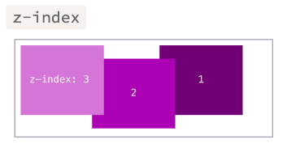

# Position

Muchas veces queremos posicionar a un elemento en otra parte de nuestro sitio web, para eso utilizaremos la propiedad de CSS position, las propiedades `top`,  `right`, `bottom`, y `left` determinan la ubicación final de los elementos posicionados.

<aside>
💡 Ejemplos de uso de position

```html
<!DOCTYPE html>
<html lang="en">
<head>
  <meta charset="UTF-8">
  <meta http-equiv="X-UA-Compatible" content="IE=edge">
  <meta name="viewport" content="width=device-width, initial-scale=1.0">
  <title>Position</title>
  <link rel="stylesheet" href="./position.css">
</head>
<body>
  <h1>Position</h1>
  <p>Mover elementos de acuerdo a la ventana</p>
  <div class="position-div">
    <p>Parrafo</p>
    <span>Span</span>
    <span class="position-left">Span izquierda superior</span>
    <span class="position-right">Span derecha superior</span>
    <span class="position-left-bottom">Span izquierda inferior</span>
    <span class="position-right-bottom">Span derecha inferior</span>

  </div>
  <p>Mover elementos de acuerdo al contenedor</p>
  <!-- Al contenedor le deberé de poner  position: relative; -->
  <div class="position-div-contenedor">
    <p>Parrafo</p>
    <span>Span</span>
    <span class="position-left">Span izquierda superior</span>
    <span class="position-right">Span derecha superior</span>
    <span class="position-left-bottom">Span izquierda inferior</span>
    <span class="position-right-bottom">Span derecha inferior</span>

  </div>

  <p>z-index</p>
  <div class="position-div-contenedor">
    <p>Parrafo</p>
    <span class="position-left z-index-1">Span izquierda superior z-index-1</span>
    <span class="position-left">Otro Span izquierda superior z-index-0 </span>
  </div>
</body>
</html>
```

```css
/* POSITION */

.position-div{
  background-color: yellowgreen;
  padding: 5px;
}

.position-div p{
  border: 1px solid black;
  padding: 5px;

}

.position-div span{
  background-color: peru;
  padding: 5px;
}

.position-left{
  position:absolute;
  top:0;
  left:0;
}

.position-right{
  position:absolute;
  top:0;
  right:0;
}

.position-left-bottom{
  position:absolute;
  bottom:0;
  left:0;
}

.position-right-bottom{
  position:absolute;
  bottom:0;
  right:0;
}

.position-div-contenedor{
  position: relative;
  background-color: rgb(131, 145, 236);
  padding: 5px;
}

.position-div-contenedor p{
  border: 1px solid black;
  padding: 5px;

}

.position-div-contenedor span{
  background-color: rgb(237, 156, 241);
  padding: 5px;
}

.z-index-1{
  background-color:green !important;
  z-index: 1;
}
```

</aside>

# Z-index

La propiedad z-index de CSS indicara el orden de un elemento posicionado y sus descendentes. Cuando varios elementos se superponen, los elementos con mayor valor z-index cubren aquellos con menor valor. 

Sirve para indicar qué elemento iría encima y cuál debajo en caso de que 2 elementos se sobrepongan, como si el documento tuviera profundidad.

Cosas interesantes saber:

- Por defecto, todos los elementos tienen asignado un valor de z-index es ***auto***, que corresponde a **0**.
- Un valor mayor hará que este se coloque delante de elementos con valores menores.
- Es posible usar valores en negativo.



# Lecturas en Campus

- Kata Intro a la Web - Position

# Recursos

[position - CSS | MDN](https://developer.mozilla.org/es/docs/Web/CSS/position)

[CSS layout cheat sheet · Web Dev Topics · Learn the Web](https://learn-the-web.algonquindesign.ca/topics/css-layout-cheat-sheet/)