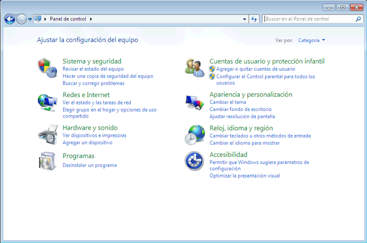

# Terminal

# Importancia de aprender a utilizar la terminal

- Aprender el uso de la terminal es una de las habilidades más básicas e indispensables que un desarrollador debe de tener.
- Nos permite realizar de forma rápida tareas básicas como crear archivos, crear carpetas, moverse entre directorios, etc.
- Cuentas con mayor flexibilidad, ya que con una serie de comandos, podemos realizar procesos grandes dentro de nuestra computadora.

# Breve historia de la terminal

Tiempo atrás, cuando tener una computadora en casa no era común, no se tenia una manera sencilla de acceder a la computadora, si querías una interfaz gráfica de linea de comandos, necesitabas comprar un dispositivo aparte.

Este aparato se llamaba terminal, el cual es un aparato muy costoso con el cual podíamos escribir los comandos a la computadora. 


# ¿Qué es la terminal /  Línea de Comandos?

Una terminal o consola es un programa de interfaz de usuario de linea de comandos que se le le llama simulador o emulador de terminal; generalmente es una pantalla de fondo negro con letras blancas, donde podemos escribir comandos ordenados.


# Conceptos básicos

### CLI

Command Line Interface o **interfaz de línea de comandos**, es un programa que permite al usuario interactuar o comunicarse con la computadora por medio de comandos de texto.


### GUI

Graphical User Interface o **interfaz gráfica de usuario**, es una interfaz que permite al usuario comunicarse con la computadora por medio de elementos gráficos como iconos, menús e imágenes.



### Shell

El Shell o **interprete de comandos** es un programa que permite al usuario acceder a otros servicios y programas de la computadora por medio de una interfaz. Normalmente se habla de una interfaz de texto el cual procesa los comandos de texto y devuelve un resultado.

## BASH

The Bourne-Again Shell, es una de las shells que están instaladas por defecto en los sistemas operativos Linux. 

## Comando

Instrucción que se escribe en una interfaz de linea de comandos, para comunicarnos con la computadora.

## Script

Grupo de comandos, con el fin de automatizar tareas.

# Comandos básicos

```jsx
$ ls
```

Enumera los archivos y carpetas normales en el directorio actual

```
$ pwd
```

Emita la ruta del directorio actual para este terminal

```jsx
$ cd
```

Cambia tu directorio de trabajo actual. Cuando se usa solo, por defecto cambiará a su directorio de inicio

```jsx
$ cd [Folder]
```

Cambia su directorio de trabajo actual al [FOLDER] deseado

```jsx
$ cd ..
```

Cambia tu directorio de trabajo actual al directorio principal

```jsx
$ mkdir [FOLDER_NAME]
```

Cambia tu directorio de trabajo actual al directorio principal

```jsx
$ rm [FILE]
```

Borrar archivo

```jsx
$ whoami
```

Imprime el nombre del usuario actual cuando se invoca, es decir;  el nombre de el usuario en sesión.

```jsx
$ rmdir [FOLDER_NAME]
```

Imprime el nombre del usuario actual cuando se invoca, es decir;  el nombre de el usuario en sesión.

# Instalación de terminal para Mac

<aside>
🚨 Es importante que el usuario de tu Mac tenga los permisos de administrador, ya que de lo contrario no podrás instalar y usar todo lo que necesitas sin esos permisos

</aside>

## Recuerda …

- **En la terminal, las contraseñas son invisibles.**

Es decir, al momento de escribir una contraseña en la terminal no se representará visualmente, ni siquiera con asteriscos. La razón principal de esto es la seguridad; si se mostrarán los asteriscos, otras personas podrán ver la longitud de tu contraseña y así podrían adivinar cuál es.

- **No escriba el signo de dólar ($) en la terminal al agregar comandos.**

Utilizamos los signos de dólar ($) para distinguir visualmente los comandos de terminal de otros tipos de código. 

<aside>
⚠️ 

Entonces si tenemos el siguiente comando

```jsx
$ algun-comando
```

Solo deberas escribir en tu terminal `algun-comando`

</aside>

## Paso 1: Instala Iterm

- Dirigete a la página principial de  [**Iterm**](https://iterm2.com/documentation.html)

[Documentation - iTerm2 - macOS Terminal Replacement](https://iterm2.com/documentation.html)

- Ve a la pagina [**downloads**](https://iterm2.com/downloads.html)

[Downloads - iTerm2 - macOS Terminal Replacement](https://iterm2.com/downloads.html)

- Descarga la version estable (Stable Releases).
- Descomprime el archivo zip.
- En el Finder, arrastra el archivo de la aplicación iTerm2 y sueltela en la carpeta de Aplicaciones.
- Para abrir el iTerm2, abra el Spotlight Search y escriba iTerm2.
- Se recomienda fijar iTerm en la barra de navegación del Dock


# Recursos

[Terminal Cheat Sheet](https://terminalcheatsheet.com/es/)

[Conceptos básicos de HTML - Aprende sobre desarrollo web | MDN](https://developer.mozilla.org/es/docs/Learn/Getting_started_with_the_web/HTML_basics)